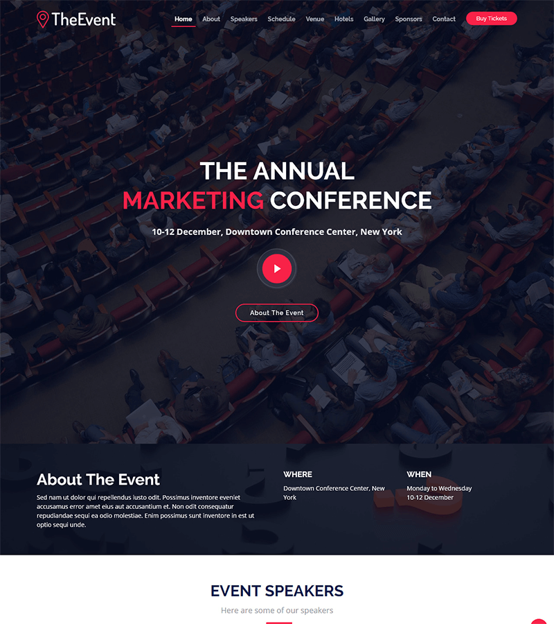

Сайт для ежегодной конференции по маркетингу *TheEvent*. Сайт создан с помощью Bootstrap 4 и Django.


## Как запустить

Скачайте код:
```sh
git clone https://github.com/devmanorg/the-event.git
```

[Установите Python](https://www.python.org/), если этого ещё не сделали. Нужна версия Python не ниже 3.6.

В каталоге проекта создайте виртуальное окружение:
```sh
python -m venv venv
```

Активируйте его. На разных операционных системах это делается разными командами:

- MacOS/Linux: `source venv/bin/activate`
- Windows: `.\venv\Scripts\activate`

Установите зависимости в виртуальное окружение:
```sh
pip install -r requirements.txt
```

Создайте базу данных и накатите миграции:

```sh
python manage.py migrate
```

Запустите сервер:

```sh
python manage.py runserver
```

По адресу [http://127.0.0.1](http://127.0.0.1/) в браузере отобразится стартовая страница:




## Цели проекта

Код написан в учебных целях — это туториал в курсе по Python и веб-разработке на сайте [Devman](https://dvmn.org). За основу был взят бесплатный шаблон Bootstrap [The Event](https://bootstrapmade.com/demo/TheEvent/) с сайта [BOOTSTRAPMADE](bootstrapmade.com).

Где используется репозиторий:

- Туториал [Как проверить данные с помощью DRF](https://devman.org/encyclopedia/django/validate-data-with-drf/)
